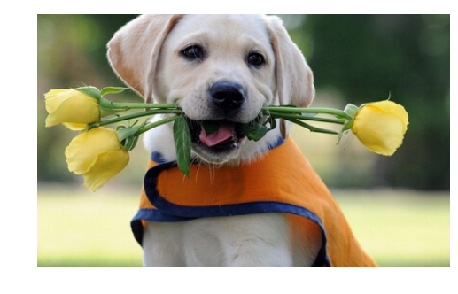
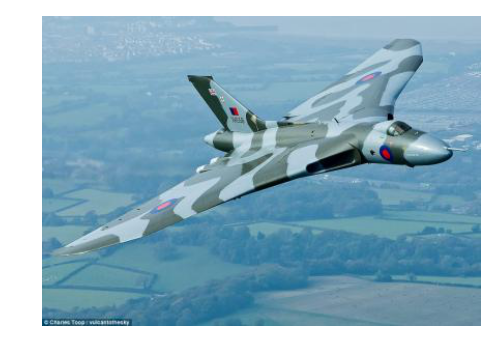

```python
#51CTO课程频道：http://edu.51cto.com/lecturer/index/user_id-12330098.html
#优酷频道：http://i.youku.com/sdxxqbf
#Github：https://github.com/Qinbf


```python
import tensorflow as tf
import os
import numpy as np
import re
from PIL import Image
import matplotlib.pyplot as plt
```


```python
class NodeLookup(object):
    def __init__(self):  
        label_lookup_path = 'inception_model/imagenet_2012_challenge_label_map_proto.pbtxt'   
        uid_lookup_path = 'inception_model/imagenet_synset_to_human_label_map.txt'
        self.node_lookup = self.load(label_lookup_path, uid_lookup_path)

    def load(self, label_lookup_path, uid_lookup_path):
        # 加载分类字符串n********对应分类名称的文件
        proto_as_ascii_lines = tf.gfile.GFile(uid_lookup_path).readlines()
        uid_to_human = {}
        #匹配0或多个n或数字，匹配0或多个空格，非空白字符，逗号
        p = re.compile(r'[n\d]*[ \S,]*')
        for line in proto_as_ascii_lines:
            parsed_items = p.findall(line)
            #获取编号字符串n********
            uid = parsed_items[0]
            #获取分类名称
            human_string = parsed_items[2]
            #保存编号字符串n********与分类名称映射关系
            uid_to_human[uid] = human_string

        # 加载分类字符串n********对应分类编号1-1000的文件
        proto_as_ascii = tf.gfile.GFile(label_lookup_path).readlines()
        node_id_to_uid = {}
        for line in proto_as_ascii:
            if line.startswith('  target_class:'):
                #获取分类编号1-1000
                target_class = int(line.split(': ')[1])
            if line.startswith('  target_class_string:'):
                #获取编号字符串n********
                target_class_string = line.split(': ')[1]
                #保存分类编号1-1000与编号字符串n********映射关系
                node_id_to_uid[target_class] = target_class_string[1:-2]

        #建立分类编号1-1000对应分类名称的映射关系
        node_id_to_name = {}
        for key, val in node_id_to_uid.items():
            #获取分类名称
            name = uid_to_human[val]
            #建立分类编号1-1000到分类名称的映射关系
            node_id_to_name[key] = name
        return node_id_to_name

    #传入分类编号1-1000返回分类名称
    def id_to_string(self, node_id):
        if node_id not in self.node_lookup:
            return ''
        return self.node_lookup[node_id]
```


```python
#创建一个图来存放google训练好的模型
with tf.gfile.FastGFile('inception_model/classify_image_graph_def.pb', 'rb') as f:
    graph_def = tf.GraphDef()
    graph_def.ParseFromString(f.read())
    tf.import_graph_def(graph_def, name='')


with tf.Session() as sess:
    softmax_tensor = sess.graph.get_tensor_by_name('softmax:0')
    #遍历目录
    for root,dirs,files in os.walk('images/'):
        for file in files:
            #载入图片
            image_data = tf.gfile.FastGFile(os.path.join(root,file), 'rb').read()
            predictions = sess.run(softmax_tensor,{'DecodeJpeg/contents:0': image_data})#图片格式是jpg格式
            predictions = np.squeeze(predictions)#把结果转为1维数据

            #打印图片路径及名称
            image_path = os.path.join(root,file)
            print(image_path)
            #显示图片
            img=Image.open(image_path)
            plt.imshow(img)
            plt.axis('off')
            plt.show()

            #排序
            top_k = predictions.argsort()[-5:][::-1]
            node_lookup = NodeLookup()
            for node_id in top_k:     
                #获取分类名称
                human_string = node_lookup.id_to_string(node_id)
                #获取该分类的置信度
                score = predictions[node_id]
                print('%s (score = %.5f)' % (human_string, score))
            print()
```

    images/car.jpg
    


    sports car, sport car (score = 0.93507)
    convertible (score = 0.01113)
    racer, race car, racing car (score = 0.00868)
    chain saw, chainsaw (score = 0.00298)
    car wheel (score = 0.00276)
    
    images/cat.jpg
    


    Egyptian cat (score = 0.55336)
    tabby, tabby cat (score = 0.25701)
    tiger cat (score = 0.08283)
    lynx, catamount (score = 0.05683)
    hyena, hyaena (score = 0.00275)
    
    images/dog.jpg
    





    Labrador retriever (score = 0.95145)
    golden retriever (score = 0.02065)
    tennis ball (score = 0.00399)
    beagle (score = 0.00093)
    Saluki, gazelle hound (score = 0.00070)
    
    images/plane.jpg
    





    warplane, military plane (score = 0.81114)
    wing (score = 0.06260)
    aircraft carrier, carrier, flattop, attack aircraft carrier (score = 0.01210)
    projectile, missile (score = 0.01136)
    missile (score = 0.00972)
    
    images/seaside.jpg
    


    seashore, coast, seacoast, sea-coast (score = 0.85502)
    sandbar, sand bar (score = 0.08791)
    lakeside, lakeshore (score = 0.02546)
    sarong (score = 0.00745)
    coral reef (score = 0.00354)
    
    
